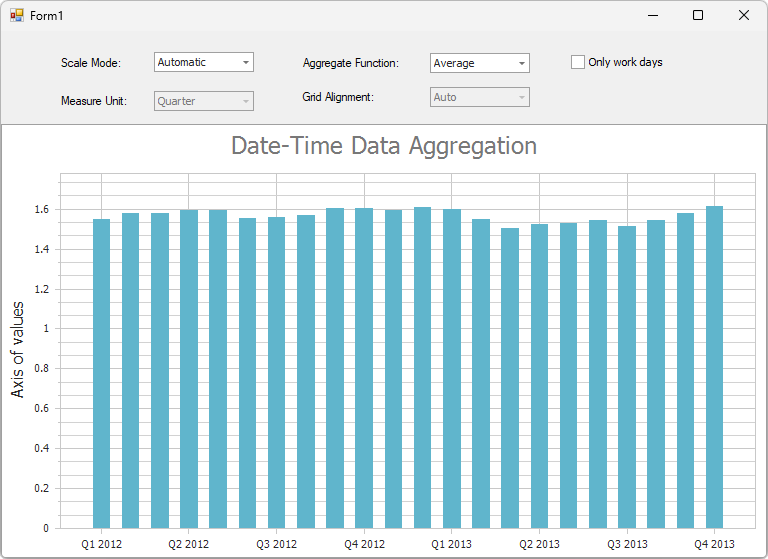

<!-- default badges list -->

[](https://supportcenter.devexpress.com/ticket/details/E1531)
[](https://docs.devexpress.com/GeneralInformation/403183)
[](#does-this-example-address-your-development-requirementsobjectives)
<!-- default badges end -->

# WinForms Chart - Date-Time Axis Scale Modes

This example customizes the appearance and behavior of the date-time axis in a WinForms Chart. It displays a panel with combo boxes that allow you to switch the X-axis between different date-time [scale modes](https://docs.devexpress.com/WindowsForms/5799/controls-and-libraries/chart-control/axes/axis-scale-types) and specify related settings.



## Implementation Details

The **Scale Mode** combo box specifies a scale mode for the X-axis:

- **Manual**
    
    In the manual mode, you can configure the following axis settings:
  
    - [DateTimeScaleOptions.GridAlignment](https://docs.devexpress.com/CoreLibraries/DevExpress.XtraCharts.DateTimeScaleOptions.GridAlignment) - specifies the alignment of grid lines and labels to a particular date-time value (e.g., start of month, start of year).
    - [DateTimeScaleOptions.MeasureUnit](https://docs.devexpress.com/CoreLibraries/DevExpress.XtraCharts.DateTimeScaleOptions.MeasureUnit) - specifies the time unit (for example, day, month, year) used to measure intervals along the axis.
    - [ScaleGridOptionsBase.AggregateFunction](https://docs.devexpress.com/CoreLibraries/DevExpress.XtraCharts.ScaleGridOptionsBase.AggregateFunction) - specifies the aggregate function (for example, MIN, MAX, AVG, SUM, etc.).


    ```csharp
    AxisX.DateTimeScaleOptions.ScaleMode = ScaleMode.Manual;
    ```

- **Automatic**
    
    The chart automatically determines date-time scale settings and applies an appropriate aggregation function. In this mode, you can specify the aggregate function.
    
    ```csharp
    AxisX.DateTimeScaleOptions.ScaleMode = ScaleMode.Automatic;
    ```

- **Continuous**
    
    Disables axis intervals and data aggregation. You can set the alignment of grid lines and labels to a specific date-time value.
    
    ```csharp
    AxisX.DateTimeScaleOptions.ScaleMode = ScaleMode.Continuous;
    ```

## Files to Review

* [Form1.cs](./CS/DateTimeAggregation/Form1.cs) (VB: [Form1.vb](./VB/DateTimeAggregation/Form1.vb))

## Documentation

- [Axis Scale Types](https://docs.devexpress.com/WindowsForms/5799/controls-and-libraries/chart-control/axes/axis-scale-types)
- [Data Aggregation](https://docs.devexpress.com/WindowsForms/6247/controls-and-libraries/chart-control/data-representation/data-aggregation)

<!-- feedback -->
## Does This Example Address Your Development Requirements/Objectives?

[](https://www.devexpress.com/support/examples/survey.xml?utm_source=github&utm_campaign=winforms-charts-use-automatic-date-time-scale-modes-of-an-axis&~~~was_helpful=yes) [](https://www.devexpress.com/support/examples/survey.xml?utm_source=github&utm_campaign=winforms-charts-use-automatic-date-time-scale-modes-of-an-axis&~~~was_helpful=no)

(you will be redirected to DevExpress.com to submit your response)
<!-- feedback end -->
